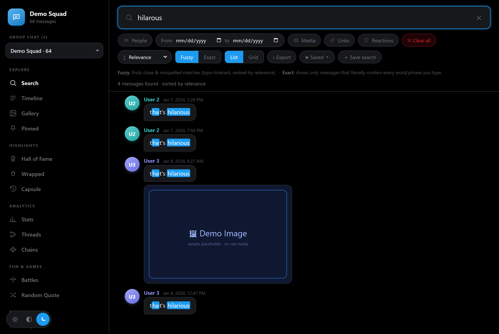
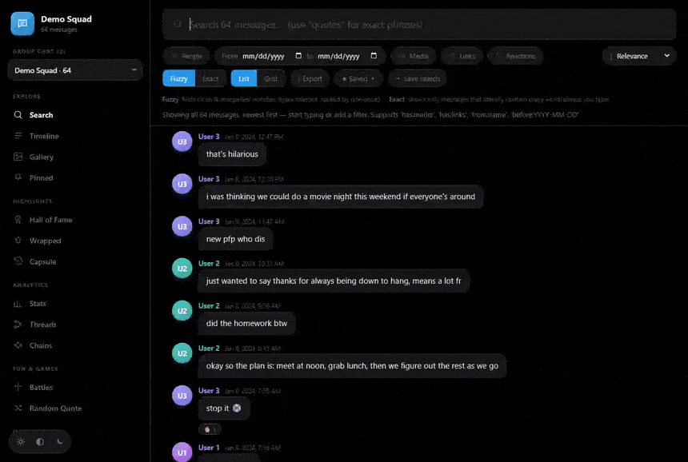

# Group Chat Archive

[](https://github.com/yib7/twitter_GC_archival/actions/workflows/ci.yml)

A dependency-free, fully offline browser for Twitter/X group chat (group DM)
exports. Drop in your export, run one build script, and explore years of group
history with fuzzy search, a virtual timeline, a media gallery, year-in-review
"Wrapped" slideshows, leaderboards, and more. No server, no API keys, no
internet. Have several group chats? A picker switches between them.

> The repo ships with synthetic demo data. No real messages, names, or media
> are committed. Open `index.html` and you'll see a runnable demo built from
> `data.sample.js`. Point it at your own export to see your real history (kept
> local and `.gitignore`d).



A quick tour through search, the timeline, the media gallery, Hall of Fame, the
Wrapped recap, and the stats dashboard (synthetic demo data):



---

## Features

- Fuzzy search (Fuse.js) that highlights the matched text in each result,
  including close typo matches, with filters: `has:media`, `has:links`,
  `from:name`, `before:/after:YYYY-MM-DD`, exact `"quoted phrases"`, sorting,
  list/grid views, saved searches, and plain-text export of the results.
- Multiple group chats: a conversation picker switches between every group in
  your export. Every view is scoped to the selected group.
- A virtual timeline that scrolls 100K+ messages smoothly, with jump-to-date in
  the Cmd/Ctrl-K command palette.
- Gallery of every photo and video, with a lightbox.
- Hall of Fame: most-reacted messages, podium and leaderboards by year.
- Wrapped, an animated year-in-review slideshow.
- Stats covering per-person activity, word clouds, milestones, busiest hours,
  and superlatives.
- Threads, Chains, and Battles for playful analytics and head-to-head.
- A Pinned view that collects bookmarked messages from every group chat, a
  Cmd/Ctrl-K command palette, a Time Capsule ("on this day"), Random Quote,
  context-peek, and quote-card PNG export.
- Theming: three modes (Light, Dim, and Lights-out, a black-and-blue default),
  with a customizable accent, adjustable density, and a theme shuffle. All
  preferences are saved to `localStorage`.
- A responsive mobile layout (≤760px): a top app bar, a 5-tab bottom bar
  (Search / Timeline / Gallery / Stats / More), and a bottom sheet for the
  remaining views.

Everything runs from `file://`, so you can just double-click `index.html`. The
included `scripts/server.js` is needed only for the first-run setup wizard
(`setup.html`) or if your browser blocks local video over `file://`. Opening
from `file://` prints a few harmless not-found lines in the browser console as
it probes for optional local data files; `npm start` serves the app and avoids
them.

Run smoke checks after installing dev dependencies:

```bash
npm install
npx playwright install chromium   # one-time: the smoke tests drive a headless browser
npm run test:smoke
```

---

## Requirements

- Browsing an archive needs only a modern browser. No install, no Node, no
  internet. Double-click `index.html`.
- The setup wizard and the local server need [Node.js](https://nodejs.org) 18 or
  newer (developed and CI-tested on Node 24, pinned in `.nvmrc`). They use only
  Node's built-in modules, so there is nothing to `npm install` to run them.
- `npm install` is needed only to run the test suite (Playwright + ESLint).
- The wizard's Browse buttons open native file dialogs on Windows. On macOS and
  Linux the wizard still works, but you paste the file and folder paths by hand.

## Quick start (demo, zero real data)

```bash
git clone https://github.com/yib7/twitter_GC_archival.git
cd twitter_GC_archival
# open the demo straight away:
#   double-click index.html
# or, if your browser blocks local media over file://:
node scripts/server.js      # -> http://localhost:8765
```

You'll get a 3-group synthetic demo. Regenerate the demo data anytime:

```bash
node scripts/make_sample.js     # writes data.sample.js + sample_media/
```

---

## Using your own export

Request your archive from X (Settings -> Your account -> Download an archive of
your data) and unzip it. The group chat archive needs all three of these:

- `direct-messages-group.js`: group chat conversations (full message content)
- `direct-messages-group-headers.js`: group metadata that completes the
  participant roster and join/leave/name events
- `direct_messages_group_media/`: group chat media (photos and videos)

*(1:1 DM files are ignored. This tool is group-chats only.)*

### Setup wizard

The wizard writes config, copies your files and media, runs the build, restores
the group photo, and walks you through naming everyone, all from the browser. It
needs the local server (writing files needs Node).

The quickest way to start it: double-click `start-setup.cmd` on Windows (or
`start-setup.command` on macOS). It launches the server and opens the wizard, and
closes itself when you close the browser tab. To start it by hand instead:

```bash
node scripts/server.js                 # -> http://localhost:8765
# then open  http://localhost:8765/setup.html
```

1. Source: click Browse to pick your `direct-messages-group.js`, your
   `direct-messages-group-headers.js`, and your media folder (all three
   required; native file dialogs on Windows), then Build.
2. Group *(optional)*: set the group name and photo (becomes the sidebar mark).
3. People *(optional)*: each participant card shows sample messages and a few
   pieces of media they shared (Twitter/X links excluded, since they don't help
   you tell people apart). Name them, add a photo, and mark which one is you.
4. Finish: saves everything and links to the archive.

Everything the wizard writes lands in one git-ignored folder, `personal_data/`
(`config.json`, the built `data.js`, `local.js`, the copied raw export under
`source/`, copied `media/`, and `pfps/`). After setup, daily use is just
double-clicking `index.html`.

> Adding a newer export later? Just re-run the wizard. The build is merge-aware,
> so your history accumulates and is never lost.

### Naming participants

X exports contain only numeric user IDs, so everyone shows as User 1, User 2,
and so on by default. The setup wizard (above) is the easiest way to name
everyone. You can always edit later in the People tab: rename, pick a color,
upload a profile picture, and mark "This is me", all saved to `localStorage`
(works from `file://`, no server). For a permanent local mapping you can also
hand-edit `personal_data/local.js` (`window.LOCAL_NAMES` / `LOCAL_PFPS` /
`LOCAL_ME` / `LOCAL_GC`).

---

## Data schema

`data.js` / `data.sample.js` define one global:

```js
window.CHAT_DATA = {
  generatedAt: "ISO",
  conversations: [
    {
      id, type: "group", title, participants: [ids], count,
      msgs:  [ { i, s, t, x, u?, m?, k?, r? } ],   // id, sender, time(ms), text, urls, media, kind, reactions
      events:[ { t, type, ... } ]                  // name/join/leave/create
    },
    ...
  ]
}
```

The viewer also accepts the older single-conversation shape
(`{ conversationId, msgs, events }`) for backward compatibility.

Private builds can omit known bad/export-only users by adding an
`ignoredUsers: ["user-id"]` array to `personal_data/config.json` before running
the wizard build, or by setting `window.LOCAL_IGNORED_USERS` in a gitignored
local override.

---

## Project layout

```
index.html          app shell + script loading
setup.html          first-run setup wizard (served)
src/app.js          all UI logic (vanilla JS, no framework)
src/styles.css      theme tokens + app styles (Light / Dim / Lights out)
src/setup.js        setup-wizard logic
src/setup.css       setup-wizard styles
scripts/build.js    config -> personal_data/data.js  (wizard-driven, merge-aware)
scripts/make_sample.js   synthetic demo generator -> data.sample.js + sample_media/
scripts/server.js   static server + setup-wizard API (range requests for video)
lib/                Fuse.js (Apache-2.0) + Chart.js (MIT), vendored
data.sample.js      committed synthetic demo data
sample_media/       committed placeholder media
docs/               architecture notes
personal_data/      (git-ignored) wizard output: config.json, data.js, local.js,
                    source/, media/, pfps/ (all your real, private data in one place)
```

Built with [Fuse.js](https://www.fusejs.io/) (Apache-2.0) and
[Chart.js](https://www.chartjs.org/) (MIT), both vendored under `lib/`. Full
attribution is in [CREDITS.md](CREDITS.md).

For how the raw export, the build step, and the viewer fit together, see
[docs/ARCHITECTURE.md](docs/ARCHITECTURE.md).

---

## Privacy

This repository is designed to be published without any private data. Real
messages, media, profile pictures, names, and packaged archives are listed in
[`.gitignore`](.gitignore). The only data committed is the fully synthetic
sample.
