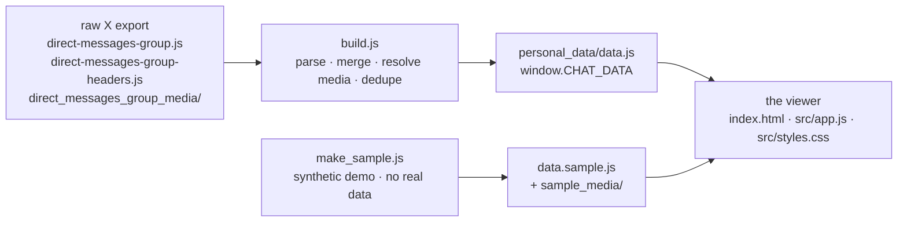

# Architecture: how the Group Chat Archive works

A short tour of the codebase for anyone reading or extending it. The whole thing
is vanilla JavaScript with two vendored libraries (Fuse.js, Chart.js) and no
build step for the front-end.

## The pipeline



For a public/demo run with no real data, `make_sample.js` substitutes for the
raw export: it synthesizes `data.sample.js` + `sample_media/` in the same schema
that the viewer reads.

### Setup wizard & `personal_data/`

First-run setup is a served page (`setup.html` + `src/setup.js` + `src/setup.css`)
backed by three small JSON endpoints in `scripts/server.js` (Node built-ins only).
It exists because a pure `file://` page can't write config or copy a multi-GB
media folder. The contract is **"UI collects config, Node builds"**: the wizard
gathers paths/names/photos and triggers `build.js` server-side.

All real, per-user data lands in one git-ignored folder:

```
personal_data/
  config.json   { sourceJs:[paths], headersJs, mediaDir, me, gcName, gcPhoto, names:{}, pfps:{} }
  data.js       built window.CHAT_DATA
  local.js      window.LOCAL_NAMES / LOCAL_PFPS / LOCAL_ME / LOCAL_GC{name,photo}
  source/       copied raw export .js (direct-messages-group.js + -headers.js)
  media/        copied group media (referenced by root-relative path)
  pfps/         gc.<ext> + <participantId>.<ext> profile images
```

`config.json` is the wizard↔build contract and the **only** way the build is
driven: `build.js` reads its `sourceJs` + `headersJs` + `mediaDir` and writes
`personal_data/data.js`. With no `config.json`, `build.js` exits and tells the
user to run the wizard. Media paths are emitted **relative to the project root**,
so they resolve regardless of where `data.js` sits.

Server endpoints:

| Endpoint | Role |
|----------|------|
| `GET /api/pick-file?for=group\|headers` · `GET /api/pick-folder` | Open a native Windows file/folder dialog (PowerShell `OpenFileDialog` / `FolderBrowserDialog`) and return the chosen absolute path, so users can browse instead of typing. `for` tailors the file dialog's title + filter. Falls back to manual entry off Windows. |
| `POST /api/source` | `{ groupJs, headersJs, mediaDir }` → validate (all three **required** and existing), copy both `.js` into `personal_data/source/` and media into `personal_data/media/`, write `config.json` (`sourceJs` = group file, `headersJs` = headers file), run `build.js`, return a summary. |
| `GET /api/parts` | Participants from the built data, each with up to 10 Twitter/X-link-free sample messages + a few shared-media paths. |
| `POST /api/identity` | `{ me, gcName, gcPhoto, names, pfps }` (images as data URLs) → write files into `personal_data/pfps/`, then `personal_data/local.js`. |

## Files

| File | Role |
|------|------|
| `scripts/build.js` | Node script. Wizard-driven (requires `personal_data/config.json`; exits otherwise). Parses the group export file (`direct-messages-group.js`), folds **every** group `dmConversation` into a per-conversation accumulator, dedupes messages by id, resolves local media by the `{messageId}-…` filename convention, and writes `personal_data/data.js`. When `config.headersJs` is set, also folds `direct-message-group-headers.js`, metadata only, so it adds no messages but completes each conversation's participant roster (senders/joiners with no surviving message) and join/leave/name events. Merge-aware: re-reads the previous build as a baseline so history accumulates. Group-chats only, 1:1 DMs (id shape `a-b`) are skipped. |
| `scripts/make_sample.js` | Node script. Deterministic synthetic-data generator → `data.sample.js` (3 group chats, ~130 messages, tagged `__sample`) plus placeholder SVG media/avatars. Zero real data. |
| `setup.html` · `src/setup.js` · `src/setup.css` | First-run setup wizard (served). Collects source paths, group name/photo, and per-participant names/pfps/"you", talking to the `scripts/server.js` API. |
| `index.html` | App shell + sidebar markup. Loads `data.sample.js` first, then gitignored real data that overrides it (`data.js`, then `personal_data/data.js`), then name overrides (`names.local.js`, then `personal_data/local.js`), then `lib/`, then `src/app.js`. |
| `src/app.js` | The entire UI. See "Runtime model" below. |
| `src/styles.css` | App styles + the X design-token theme system: `html[data-theme]` blocks for Light, Dim, and Lights out. Accent, font size, and density stay JS-driven CSS variables. |
| `scripts/server.js` | Static file server with HTTP range support (for video) **plus** the setup-wizard API (`/api/source`, `/api/parts`, `/api/identity`). Not required for daily use, the app runs from `file://`. |
| `lib/` | Vendored Fuse.js (Apache-2.0) + Chart.js (MIT). |

## Data schema (`window.CHAT_DATA`)

```js
{
  generatedAt,
  conversations: [
    { id, type:"group", title, participants:[id], count,
      msgs:  [ { i, s, t, x, u?, m?, k?, r? } ],   // id, sender, time(ms), text,
                                                   //   urls, media-path, kind, reactions
      events:[ { t, type:"name"|"join"|"leave"|"create", ... } ] }
  ]
}
```
The viewer also accepts the legacy single-conversation shape
(`{ conversationId, msgs, events }`), `normalizeConvos()` wraps it into a
one-element `conversations` array.

## Runtime model (`app.js`)

`src/app.js` is one IIFE. The key design idea behind multi-group support:

- **`CONVOS`**: the full list of conversations (from `CHAT_DATA`).
- **Active-conversation state**: `CONV`, `MSGS`, `EVENTS`, `N`, `LOWER`
  (lowercased text cache), `ID2IDX`, `PARTS` (participants), `GENERIC`
  (`id → "User N"`). These are module-level `let`s that get **reassigned** when
  the conversation changes.
- **`activateConversation(id, rerender)`**: the switch point. It loads the
  conversation's messages into `MSGS`, rebuilds the search indexes
  (`rebuildIndexes()`), drops every derived cache and per-view state
  (`resetDerived()`), recomputes `PARTS`, assigns generic names, and (when
  `rerender`) refreshes the brand, the picker, the sparkline, and the current
  view.

Because all views read from the same module-level `MSGS`/`PARTS`/caches, they
become conversation-scoped "for free", switching simply swaps the data under
them and forces a re-render. The conversation picker (`renderConvPicker()`) is a
`<select>` in the sidebar, shown only when there is more than one group.

Boot happens at the very end of the IIFE (after all `let`s are declared, so
`resetDerived()` doesn't hit a temporal-dead-zone) → `activateConversation()` →
`init()`.

### Names & avatars
The export has only numeric ids. Committed defaults are empty, so people render
as **User 1…N** (`GENERIC`, assigned per-conversation by message rank). Priority
in `nameOf()`: user-saved (`settings.names`, People tab → localStorage) →
`window.LOCAL_NAMES` (gitignored `local.js`) → `GENERIC` → `User <id4>`.
Profile pictures: `PFPS = { ...LOCAL_PFPS, ...settings.pfps }`, where in-app
uploads (People tab) are stored as data URLs in `settings.pfps` so editing works
from `file://` with no server. The group photo + name come from
`window.LOCAL_GC` / `settings.gcPhoto`/`gcName` (`updateBrand()`), and the
wizard's "this is you" marker is `window.LOCAL_ME` (a default for `settings.me`).

### First-run onboarding
The shipped demo (`data.sample.js`) carries a `__sample` flag; any real build
overrides `CHAT_DATA` without it. `app.js` reads this as `IS_SAMPLE` and shows a
dismissible onboarding overlay (`maybeShowOnboarding()`) when the demo is loaded,
or when real data is loaded but nobody is named/marked yet, linking to the setup
wizard or the People tab.

### Views (registered in `setView`)
Search, Timeline (virtualized), Gallery, Pinned, Hall of Fame, Wrapped, Capsule,
Stats, Threads, Chains, Battles, People, Settings, plus Random Quote and the
⌘K command palette.

### Local data
All viewer state (theme, names, profile pictures, bookmarks, saved searches)
lives in `localStorage` under `gca.*` keys.
